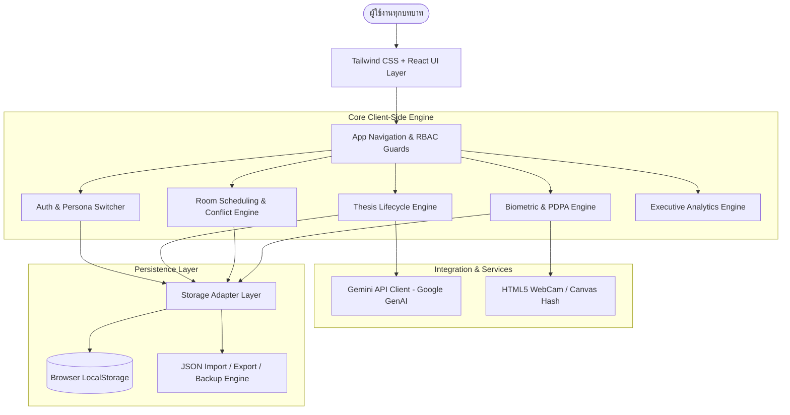
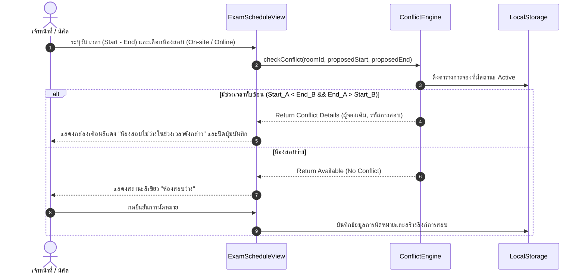
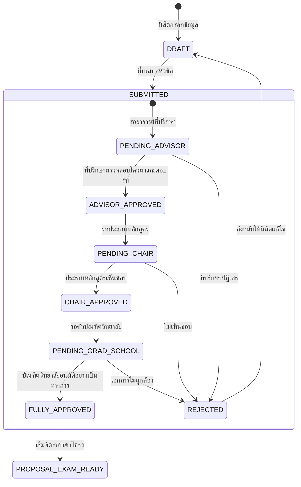

# System Architecture Document (architecture.md)
## Graduate Thesis Management and Tracking System (GTMTS)

---

## 1. System Overview & Architectural Style
ระบบ **GTMTS** ได้รับการออกแบบภายใต้สถาปัตยกรรม **Client-Side Reactive SPA (Single Page Application)** ที่เน้นความคล่องตัวสูง รองรับการประมวลผลบนเบราว์เซอร์อย่างเต็มประสิทธิภาพ และทำงานร่วมกับ **Google AI Studio** / **Gemini API** ผ่านการพัฒนาแบบ **Vibe Coding**

### สถาปัตยกรรมระดับสูง (High-Level Topology)



---

## 2. Technology Stack

| Layer | Technology | Rationale & Selection |
| :--- | :--- | :--- |
| **Language** | **TypeScript 5.x** | ป้องกัน Type Error, รองรับ Data Models ที่ซับซ้อนของวิทยานิพนธ์แบบ 100% Type-Safe |
| **Runtime & Bundler** | **Node.js 20+ & Vite** | บิวด์ไว ตอบสนองรวดเร็ว มี Hot Module Replacement (HMR) สำหรับการพัฒนา Vibe Code |
| **UI Framework** | **React 18 / 19** | Component-driven architecture, รองรับ Hooks และ State Management ที่ยืดหยุ่น |
| **Styling & Design** | **Tailwind CSS 3.4+** | Utility-first, จัดการ Light Theme โทนชมพู-เทา และกำหนดขนาด `max-w-5xl` ได้เฉียบคม |
| **Iconography** | **Lucide React** | ไอคอนสไตล์มินิมอล ครอบคลุมงานวิชาการ ปฏิทิน ห้องสอบ และสถานะต่าง ๆ |
| **AI SDK** | **Google GenAI SDK (`@google/genai`)** | เชื่อมต่อโมเดล Gemini 1.5 Flash / Pro เพื่อวิเคราะห์บทคัดย่อและชื่อหัวข้อวิทยานิพนธ์ |
| **Persistence Engine** | **LocalStorage + JSON Handler** | ไม่ต้องต่อ Database ภายนอก ข้อมูลคงอยู่แม้รีเฟรช และพกพาข้อมูลผ่าน JSON ได้ 100% |
| **Biometric Capture** | **HTML5 MediaDevices + Canvas API** | ถ่ายภาพและคำนวณ Feature Hash เชิงข้อความโดยตรงบน Client-side ตามหลัก PDPA |

---

## 3. Core Component Architecture

### 3.1 Directory Structure
```text
src/
├── assets/                  # รูปภาพ ไอคอน และสไตล์ตั้งต้น
├── components/              # Reusable UI Components
│   ├── common/              # Button, Card, Modal, Badge, LoadingSpinner, EmptyState
│   ├── layout/              # Navbar, Sidebar, Footer, ProjectorViewToggle
│   ├── rbac/                # RoleSwitcher, PermissionGuard
│   ├── forms/               # ProposalForm, DefenseForm, AdvisoryLogForm
│   └── calendar/            # RoomTimeline, TimeSlotPicker, ConflictWarning
├── contexts/                # React Contexts สำหรับ Global State (Auth, Thesis, Settings)
├── hooks/                   # Custom Hooks (useThesis, useRoomBooking, useGemini, useFaceScanner)
├── models/                  # TypeScript Interfaces และ Type Definitions
├── services/                # Gemini API Service, Storage Engine, ExportImportService
├── utils/                   # Data Validators, Date Formatters, ConflictCalculators
└── views/                   # หน้าหลักตาม Flow การทำงาน
    ├── DashboardView.tsx    # แดชบอร์ดสรุปผลและสถิติรายวัน
    ├── ProposalView.tsx     # ยื่นและอนุมัติหัวข้อ/ที่ปรึกษา
    ├── ExamScheduleView.tsx # จัดตารางห้องสอบเค้าโครง/สอบจบ
    ├── ProgressView.tsx     # บันทึกการเข้าพบและประเมิน S/U
    ├── DefenseView.tsx      # ตรวจ Pre-requisites และสอบปากเปล่า
    ├── ArchivingView.tsx    # ตรวจ Plagiarism และลงลายเซ็น Approval Sheet
    ├── AttendanceView.tsx   # เช็คชื่อและลงทะเบียนใบหน้า (PDPA)
    └── AdminSettingsView.tsx# สลับสิทธิ์, Export/Import JSON, ล้างระบบ
```

---

## 4. Key Subsystems & Interaction Logic

### 4.1 Room Scheduling & Conflict Resolution Engine
เครื่องมือจัดตารางสอบมาพร้อมกับ **Conflict Matrix Checker** เพื่อป้องกันการจองห้องสอบชนกัน:



### 4.2 Hierarchical Approval State Machine
กระบวนการอนุมัติหัวข้อและแต่งตั้งที่ปรึกษาใช้กลไก Deterministic Finite State Machine:



### 4.3 Biometric Hash & PDPA Compliance Layer
เพื่อปฏิบัติตาม พ.ร.บ. คุ้มครองข้อมูลส่วนบุคคล (PDPA):
1. **Consent Capture:** ผู้ใช้ต้องกดยืนยัน Checkbox ยินยอมให้ประมวลผลข้อมูลชีวมิติสำหรับการยืนยันตัวตนทางวิชาการ
2. **Feature Hash Extraction:** ภาพจาก WebCam ถูกส่งเข้า Canvas ในหน่วยความจำเพื่อคำนวณจุดพิกัดหรือทำ SHA-256 Hash ของ Facial Signature
3. **No Image Storage:** ระบบบันทึกเฉพาะสตริงข้อความ เช่น `FACE_SIG_8a3f7c19b4...` ลงใน LocalStorage โดยไม่มีการบันทึกภาพถ่ายหรือ Base64 Raw Images

---

## 5. UI/UX Rules & Guidelines
1. **Container Constraint:** คอนเทนต์ทุกหน้าต้องถูกห่อหุ้มด้วย `<div className="max-w-5xl mx-auto px-4 sm:px-6 py-6">`
2. **Typography Rule:** ขนาดตัวอักษรหัวเรื่องหน้าสูงสุดคือ `text-3xl font-bold` หรือไม่เกิน `text-4xl` (ห้ามใช้ `text-5xl` หรือ `text-6xl`)
3. **Color Tokens:**
   * Primary Action: `bg-pink-600 hover:bg-pink-700 text-white`
   * Secondary Action: `bg-slate-100 hover:bg-slate-200 text-slate-700`
   * Subtle Accent: `bg-pink-50 text-pink-700 border border-pink-200`
   * Card Style: `bg-white border border-slate-200 rounded-xl shadow-sm p-6`
4. **Resilience & Feedback:**
   * ทุกการเรียกใช้ Gemini API หรือการสลับข้อมูลต้องแสดง `LoadingSpinner` พร้อมข้อความแจ้งความคืบหน้า
   * หน้าที่ยังไม่มีข้อมูลต้องเรนเดอร์คอมโพเนนต์ `EmptyState` พร้อมรูปไอคอนและปุ่มนำทางไปทำรายการ
