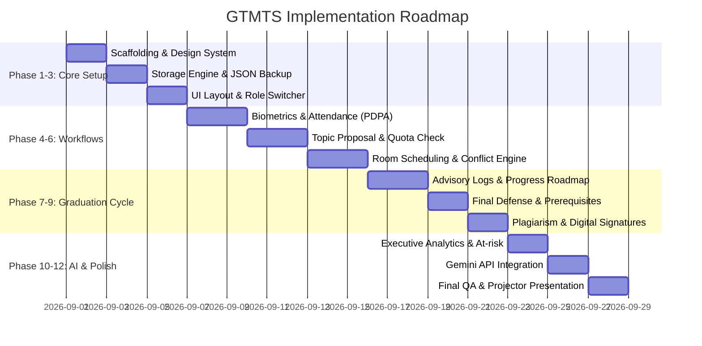

# Implementation Plan (implementation-plan.md)
## Graduate Thesis Management and Tracking System (GTMTS)

แผนการพัฒนาระบบฉบับละเอียดสำหรับกระบวนการ **Vibe Coding** บน **Google AI Studio** / WebApp โดยมุ่งเน้นการสร้างระบบที่เสร็จสมบูรณ์ ใช้งานได้จริง มีสถานะข้อมูลคงอยู่ (Persistent) และพร้อมนำเสนอผลงานได้ทันที

---

## สรุปภาพรวมลำดับขั้นการพัฒนา (Development Roadmap)

---

## รายละเอียดแต่ละระยะการพัฒนา (Phases)

### Phase 1: การเตรียมโครงสร้างโปรเจกต์และ Design System
* **เป้าหมาย:** วางรากฐานโปรเจกต์ด้วย TypeScript, React และ Tailwind CSS
* **งานที่ต้องทำ:**
  1. ติดตั้ง Tailwind CSS พร้อมกำหนดพาเลตต์สี:
     * Backgrounds: `bg-white`, `bg-slate-50`, `bg-gray-100`
     * Primary Brand: `pink-600`, `pink-700`, `rose-500`
     * Secondary / Neutrals: `slate-700`, `slate-600`, `gray-400`
  2. กำหนด Container Constraint: คอนเทนต์ทุกหน้าห่อหุ้มด้วย `max-w-5xl mx-auto px-4`
  3. บังคับใช้ขนาด Heading ไม่เกิน `text-4xl`
  4. ติดตั้ง `lucide-react` สำหรับไอคอนระบบ

### Phase 2: เครื่องมือจัดการ State และระบบสำรองข้อมูล (Storage & JSON Backup Engine)
* **เป้าหมาย:** สร้าง Data Persistence Layer ที่ไม่สูญหายเมื่อรีเฟรช พร้อมระบบพกพาข้อมูล
* **งานที่ต้องทำ:**
  1. สร้าง Initial Seed Data จำลองนิสิต 10+ คน (ในสถานะต่าง ๆ เช่น เสนอหัวข้อ, รอสอบเค้าโครง, ทำวิจัย, สอบปากเปล่า)
  2. จำลองอาจารย์ 5 ท่าน พร้อมกำหนด `maxStudentQuota` และ `currentStudentCount`
  3. พัฒนาระบบ **Export ข้อมูลเป็นไฟล์ JSON** (`gtmts_backup.json`)
  4. พัฒนาระบบ **Import ข้อมูลจากไฟล์ JSON** พร้อมตรวจสอบความถูกต้องของ Schema
  5. พัฒนาปุ่ม **"ล้างข้อมูลทั้งระบบ" (One-Click System Wipe)** สำหรับรีเซ็ตระบบกลับเป็นค่าเริ่มต้น

### Phase 3: Layout, Navigation และ Role Switcher
* **เป้าหมาย:** ให้ผู้ใช้งานสามารถทดสอบและสลับดูมุมมองทั้ง 5 บทบาทได้อย่างง่ายดาย
* **งานที่ต้องทำ:**
  1. พัฒนา Navbar และเมนูนำทางตามสิทธิ์ของผู้ใช้งาน
  2. พัฒนาคอมโพเนนต์ **Role Switcher Dropdown** ด้านบนขวา เพื่อสลับบทบาทจำลอง:
     * นิสิต (Student)
     * อาจารย์ที่ปรึกษา (Advisor)
     * กรรมการสอบ (Committee)
     * บัณฑิตวิทยาลัย (Officer)
     * ผู้ดูแลระบบ (Admin)
  3. พัฒนาคอมโพเนนต์กลาง:
     * `<LoadingSpinner />`: แสดงทุกจุดที่มีการโหลด/ประมวลผล
     * `<EmptyState title="..." description="..." action="..." />`: แสดงเมื่อยังไม่มีข้อมูล
     * `<ProjectorModeToggle />`: สลับเพื่อเร่งคอนทราสต์เมื่อฉายจอโปรเจกเตอร์

### Phase 4: ระบบลงทะเบียนใบหน้า (PDPA) และเช็คชื่อนักศึกษา
* **เป้าหมาย:** ฟังก์ชันความปลอดภัยและยืนยันตัวตนชีวมิติตามข้อกำหนดในใบงาน
* **งานที่ต้องทำ:**
  1. หน้าฟอร์มลงทะเบียนนิสิตใหม่ พร้อมช่อง **Checkbox ยินยอมตาม PDPA**
  2. โมดูล WebCam Capture จำลองการสแกนและแปลงภาพถ่ายเป็น **Text Signature Hash** (ไม่เก็บภาพจริง)
  3. ระบบเช็คชื่อ 2 รูปแบบ: แบบสแกนใบหน้า และแบบเลือกรายชื่อปกติ
  4. ตารางสรุป 10 คนล่าสุด และกราฟแสดงสถิติผู้มาเรียนย้อนหลัง 7 วัน

### Phase 5: ระบบเสนอหัวข้อและแต่งตั้งอาจารย์ที่ปรึกษา (Topic & Quota Workflow)
* **เป้าหมาย:** กระบวนการยื่นหัวข้อพร้อมตรวจสอบโควตาและสายอนุมัติ
* **งานที่ต้องทำ:**
  1. ฟอร์มเสนอหัวข้อ 2 ภาษา (ไทย-อังกฤษ) และกรอกบทคัดย่อย่อ
  2. ฟังก์ชันตรวจสอบโควตานิสิตของอาจารย์ที่ปรึกษาแบบ Real-time (หากโควตาเต็มระบบจะแจ้งเตือนและไม่อนุญาตให้เลือก)
  3. กระบวนการอนุมัติแบบลำดับขั้น (Hierarchical Approval Flow):
     * อาจารย์ที่ปรึกษากดรับรอง $\rightarrow$ ประธานหลักสูตรเห็นชอบ $\rightarrow$ บัณฑิตวิทยาลัยอนุมัติ

### Phase 6: ระบบจัดสอบเค้าโครงและจัดการห้องสอบ (Exam & Room Scheduling)
* **เป้าหมาย:** จัดตารางนัดหมายห้องสอบ ป้องกันการจองชนกัน รองรับทั้ง On-site และ Online
* **งานที่ต้องทำ:**
  1. ระบบคำร้องขอสอบเค้าโครง และเสนอแต่งตั้งคณะกรรมการสอบ
  2. **Room Booking & Conflict Engine:**
     * เลือกห้องสอบ On-site ตรวจสอบช่วงเวลาซ้อนทับอัตโนมัติ ($Start_A < End_B \land End_A > Start_B$)
     * รองรับห้องสอบ Online โดยสร้างลิงก์การประชุม (Zoom / Teams)
  3. ฟอร์มบันทึกผลสอบของคณะกรรมการ (ผ่าน / ผ่านแบบมีเงื่อนไข / ไม่ผ่าน) พร้อมบันทึกข้อเสนอแนะ

### Phase 7: ระบบบันทึกการให้คำปรึกษาและติดตามความก้าวหน้า (Progress Tracking)
* **เป้าหมาย:** ติดตามงานวิจัยอย่างเป็นรูปธรรม
* **งานที่ต้องทำ:**
  1. **Advisory Meeting Log:** นิสิตกรอกสรุปการพบอาจารย์ และอาจารย์กดยืนยัน (Confirmation)
  2. **Semester Progress Report:** นิสิตส่งรายงานความก้าวหน้ารายเทอม
  3. **Progress Evaluation:** อาจารย์ประเมินผลผ่านเกณฑ์ S (Satisfactory) หรือ U (Unsatisfactory)
  4. **Visual Progress Timeline & Roadmap:** กราฟิกแสดงเส้นทางและ Progress Bar เปอร์เซ็นต์ความคืบหน้า

### Phase 8: การขอสอบปากเปล่าขั้นสุดท้าย (Final Defense & Prerequisites)
* **เป้าหมาย:** ตรวจสอบคุณสมบัติก่อนสำเร็จการศึกษาและจัดการสอบจบ
* **งานที่ต้องทำ:**
  1. **Automated Prerequisite Checker:** ตรวจสอบผลสอบภาษาอังกฤษ และหลักฐานการตีพิมพ์บทความ
  2. ยื่นคำร้องขอสอบปากเปล่า และจัดตารางห้องสอบรอบสุดท้าย
  3. ระบบลงคะแนนและสรุปมติกรรมการสอบแบบอิเล็กทรอนิกส์

### Phase 9: ตรวจเล่มสมบูรณ์ ตรวจ Plagiarism และระบบลายเซ็นดิจิทัล
* **เป้าหมาย:** กระบวนการปิดเล่มวิทยานิพนธ์เพื่อจัดเก็บเข้าคลังปัญญา
* **งานที่ต้องทำ:**
  1. ฟอร์มอัปโหลดเล่มวิทยานิพนธ์ฉบับแก้ไขสมบูรณ์
  2. บันทึกผลตรวจสอบการคัดลอก (Turnitin / อักขราวิสุทธิ์) พร้อมแสดงค่า Similarity Index (%)
  3. **Digital Signature Simulation:** ระบบลงนามอิเล็กทรอนิกส์บนหน้าอนุมัติเล่ม (Approval Sheet)
  4. ปุ่มจำลองการส่งออกไฟล์เข้าสู่คลังปัญญาสถาบัน (Institutional Repository)

### Phase 10: แดชบอร์ดและระบบแจ้งเตือนสำหรับผู้บริหาร (Executive Dashboard)
* **เป้าหมาย:** สรุปข้อมูลภาพรวมเชิงวิเคราะห์สำหรับคณะและสถาบัน
* **งานที่ต้องทำ:**
  1. **Advisor Dashboard:** แสดงรายการนิสิตในความดูแล และกล่องแจ้งเตือนกลุ่มเสี่ยง (At-risk Alert)
  2. **Executive Dashboard:**
     * อัตราการสำเร็จการศึกษาตามระยะเวลา (On-time Graduation Rate)
     * สถิติสถานะนิสิตแยกตามภาควิชา/สาขา
     * กราฟและตารางรายงานประกันคุณภาพการศึกษา (QA Report)

### Phase 11: การบูรณาการ Gemini API (@google/genai)
* **เป้าหมาย:** เพิ่มพลัง AI ช่วยเหลืองานวิชาการ
* **งานที่ต้องทำ:**
  1. **AI Title Improver:** ให้ Gemini แนะนำการปรับปรุงชื่อวิทยานิพนธ์ภาษาไทยและภาษาอังกฤษให้ถูกต้องตามหลักวิชาการ
  2. **AI Abstract Summarizer:** ช่วยสรุปใจความสำคัญจาก Concept Note ให้อยู่ในรูปแบบ Executive Summary
  3. ฟังก์ชันจำลอง (Fallback Mode) กรณีไม่ได้ใส่ Gemini API Key เพื่อให้ระบบยังคงทำงานได้ต่อเนื่อง

### Phase 12: การตรวจสอบและทดสอบระบบขั้นสุดท้าย (Verification & Polish)
* **เป้าหมาย:** ตรวจสอบความถูกต้องสมบูรณ์และทดสอบการนำเสนอ
* **งานที่ต้องทำ:**
  1. ทดสอบปุ่ม One-Click System Reset และฟังก์ชัน Export/Import JSON ซ้ำ
  2. ทดสอบการแสดงผลบนโหมดโปรเจกเตอร์ (Projector Presentation Mode)
  3. ตรวจสอบสถานะ Loading Spinner และ Empty State ครบทุกหน้า
